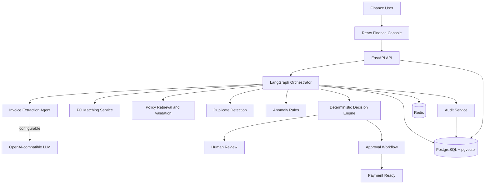

# LedgerFlow — AI Finance Operations Agent

LedgerFlow is a production-oriented Accounts Payable automation MVP that turns uploaded invoices into controlled, auditable approval work. It combines document extraction, purchase-order matching, policy validation, duplicate detection, anomaly scoring, and human approval in one workflow.

This project is intentionally **not a finance chatbot**. AI components help interpret documents and retrieve policy context, while deterministic services remain authoritative for money, rules, workflow state, and approval decisions.

## What the system does

```text
Invoice upload
    ↓
Document extraction
    ↓
Field and amount validation
    ↓
Purchase-order matching
    ↓
Policy retrieval and validation
    ↓
Duplicate and anomaly checks
    ↓
Deterministic decision engine
    ↓
Human approval or exception review
    ↓
Payment-ready status
```

LedgerFlow never initiates the payment. `PAYMENT_READY` only indicates that the configured validation and human-approval requirements have been satisfied.

## Core capabilities

- Upload PDF, PNG, JPG, and JPEG invoices with file-signature and size validation.
- Persist invoices, vendors, purchase orders, documents, approvals, workflow runs, and audit events.
- Extract structured invoice fields with confidence scores.
- Calculate subtotal, tax, totals, variance, remaining PO value, and due dates using `Decimal`.
- Match invoice vendor, currency, amount, and line-item information against purchase orders.
- Detect duplicates through document hashes and invoice identity combinations.
- Retrieve relevant, versioned finance policies and preserve source evidence.
- Calculate explainable anomaly scores using transparent rules.
- Route invoices to the appropriate human approval level.
- Record approval, rejection, and clarification decisions in the audit history.
- Display invoice and risk metrics in a responsive finance dashboard.

## Engineering principles

The following constraints are treated as system invariants:

1. The LLM never performs financial arithmetic.
2. The LLM cannot invent or override finance policies.
3. The LLM cannot approve an invoice or change workflow status directly.
4. Monetary values use Python `Decimal` and fixed-precision database columns.
5. Duplicate, PO, threshold, decision, and approval-routing checks are deterministic.
6. Every financial action requires an authorized human decision.
7. There is no payment-execution endpoint.
8. Logs contain metadata and redacted summaries, not full documents or sensitive banking data.

## Technology stack

### Backend

- Python 3.12
- FastAPI and Pydantic
- SQLAlchemy 2 and Alembic
- PostgreSQL 16 with pgvector
- Redis
- LangGraph
- Structured JSON logging

### Frontend

- React
- TypeScript
- Vite
- Recharts
- Lucide icons
- Custom responsive CSS design system

### Infrastructure and testing

- Docker and Docker Compose
- Pytest and pytest-asyncio
- PostgreSQL and Redis health checks
- SQLite development fallback

## Architecture



The LLM boundary is deliberately narrow. It may produce schema-constrained extraction candidates or summarize retrieved policy evidence. The validation layer verifies those outputs before they affect the workflow.

## Repository layout

```text
.
├── backend/
│   ├── alembic/                 # Database migrations
│   ├── app/
│   │   ├── agents/              # LangGraph and AI agent components
│   │   ├── api/                 # FastAPI routes and dependencies
│   │   ├── core/                # Configuration and logging
│   │   ├── db/                  # Async database session and base models
│   │   ├── document_processing/ # Replaceable document processor
│   │   ├── models/              # SQLAlchemy entities
│   │   ├── schemas/             # Pydantic request/response models
│   │   └── services/            # Deterministic finance services
│   ├── tests/                   # Unit and integration test area
│   ├── Dockerfile
│   └── requirements.txt
├── frontend/
│   ├── src/                     # React application and typed API client
│   └── Dockerfile
├── sample-data/                 # Example policies and purchase orders
├── docs/                        # Architecture and API notes
├── docker-compose.yml
└── .env.example
```

## Quick start with Docker

### Prerequisites

- Docker Desktop with Docker Compose
- Git

### Start the application

```bash
git clone https://github.com/Asmi-Shetty/Finance_Operation_Agent.git
cd Finance_Operation_Agent
cp .env.example .env
docker compose up --build
```

On Windows PowerShell:

```powershell
Copy-Item .env.example .env
docker compose up --build
```

After the containers become healthy, open:

| Service | URL |
|---|---|
| Finance dashboard | <http://localhost:5173> |
| OpenAPI documentation | <http://localhost:8000/docs> |
| Backend health check | <http://localhost:8000/health> |
| Backend readiness check | <http://localhost:8000/health/ready> |

The Docker stack starts the frontend, backend, PostgreSQL/pgvector, and Redis. The deterministic workflow foundation does not require an LLM API key.

## Local backend development

Install Python 3.12 or newer, then run from `backend`:

```powershell
python -m venv .venv
.venv\Scripts\Activate.ps1
python -m pip install -r requirements.txt
alembic upgrade head
uvicorn app.main:app --reload
pytest
```

When `DATABASE_URL` is not configured, the backend uses local SQLite. PostgreSQL is used by Docker.

## Local frontend development

Install Node.js 20 or newer, then run from `frontend`:

```bash
npm install
npm run dev
```

Set `VITE_API_URL` when the backend is not available at `http://localhost:8000/api/v1`.

## Configuration

Create `.env` from `.env.example`. Important settings include:

| Variable | Purpose |
|---|---|
| `DATABASE_URL` | Async PostgreSQL or SQLite connection URL |
| `REDIS_URL` | Redis connection used for workflow coordination |
| `UPLOAD_DIR` | Private invoice-document storage directory |
| `MAX_UPLOAD_BYTES` | Maximum accepted invoice size |
| `EXTRACTION_CONFIDENCE_THRESHOLD` | Minimum accepted field confidence |
| `PO_VARIANCE_TOLERANCE` | Configured acceptable invoice/PO variance |
| `LLM_PROVIDER` | LLM adapter identifier, initially `openai` |
| `LLM_MODEL` | Configurable model name; never hardcoded |
| `OPENAI_API_KEY` | Optional provider credential |
| `LANGFUSE_ENABLED` | Enables optional LLM observability |
| `CORS_ORIGINS` | Allowed frontend origins |

Never commit `.env` or API credentials. Only `.env.example` belongs in source control.

## API overview

All workflow endpoints use the `/api/v1` prefix.

| Method | Endpoint | Purpose |
|---|---|---|
| `POST` | `/invoices/upload` | Upload and validate an invoice document |
| `GET` | `/invoices` | List invoices with pagination and filtering |
| `GET` | `/invoices/{invoice_id}` | Retrieve an invoice |
| `POST` | `/invoices/{invoice_id}/process` | Start invoice processing |
| `POST` | `/invoices/{invoice_id}/validate` | Run deterministic validation |
| `GET` | `/invoices/{invoice_id}/analysis` | Retrieve risk and workflow analysis |
| `POST` | `/invoices/{invoice_id}/approve` | Record an authorized approval |
| `POST` | `/invoices/{invoice_id}/reject` | Reject an invoice with comments |
| `POST` | `/invoices/{invoice_id}/request-clarification` | Pause for more information |
| `GET` | `/invoices/{invoice_id}/audit` | Retrieve audit history |
| `GET` | `/dashboard` | Retrieve dashboard aggregates |

See [`docs/api.md`](docs/api.md) and the generated `/docs` page for the live OpenAPI contract.

## Workflow states

```text
UPLOADED → PROCESSING → VALIDATED / EXCEPTION
                            ↓
                    PENDING_APPROVAL
                    ├── PAYMENT_READY
                    ├── REJECTED
                    └── CLARIFICATION_REQUESTED
```

`PAID` is reserved for a future authorized ERP or payment integration and is not reachable through the current API.

## Deterministic finance services

- `calculations.py` performs money and date calculations.
- `po_matching.py` compares invoices to purchase orders.
- `duplicate_detection.py` evaluates exact duplicate signals.
- `policy_validation.py` applies structured policy rules.
- `anomaly_detection.py` generates explainable risk scores.
- `decision_engine.py` selects the allowed workflow route.

These services are independently testable and never call an LLM.

## Security and audit controls

- Uploaded files are checked using both media type and binary signature.
- File sizes are bounded and storage names are generated by the application.
- Secrets and connection credentials are supplied through environment variables.
- Logs exclude complete document bodies, bank data, and payment-card data.
- Workflow mutations create audit events with request IDs and bounded summaries.
- Invalid or out-of-sequence state transitions are rejected.
- Rejection and clarification actions require reviewer comments.
- The architecture is ready for external authentication and role-based authorization.
- The application cannot automatically initiate a payment.

## Current implementation status

| Area | Status |
|---|---|
| FastAPI foundation and health checks | Implemented |
| Database models and initial migration | Implemented |
| Invoice upload protections | Implemented |
| Finance calculation and validation services | Implemented |
| LangGraph state and graph skeleton | Implemented |
| Dashboard UI | Implemented |
| Unit-test foundation | Implemented |
| Production OCR/document intelligence adapter | Planned |
| Full database-backed workflow execution | In progress |
| pgvector policy ingestion and retrieval | Planned |
| Enterprise SSO and complete RBAC enforcement | Planned |
| ERP integration and payment export | Out of MVP scope |

## Roadmap

1. Connect document extraction and validation to persisted workflow runs.
2. Add policy ingestion, chunking, embeddings, and pgvector retrieval.
3. Complete invoice detail, exception review, approval, and audit screens.
4. Add integration tests for the upload-to-payment-ready journey.
5. Add OpenTelemetry metrics and optional Langfuse tracing.
6. Integrate enterprise identity and enforce separation of duties.
7. Add replaceable Azure Document Intelligence, Textract, or Google Document AI adapters.

## Additional documentation

- [`docs/architecture.md`](docs/architecture.md) — system design and workflow boundaries
- [`docs/api.md`](docs/api.md) — endpoint summary and API behavior

## License

No open-source license has been selected. Unless a license is added, all rights are reserved by the repository owner.
