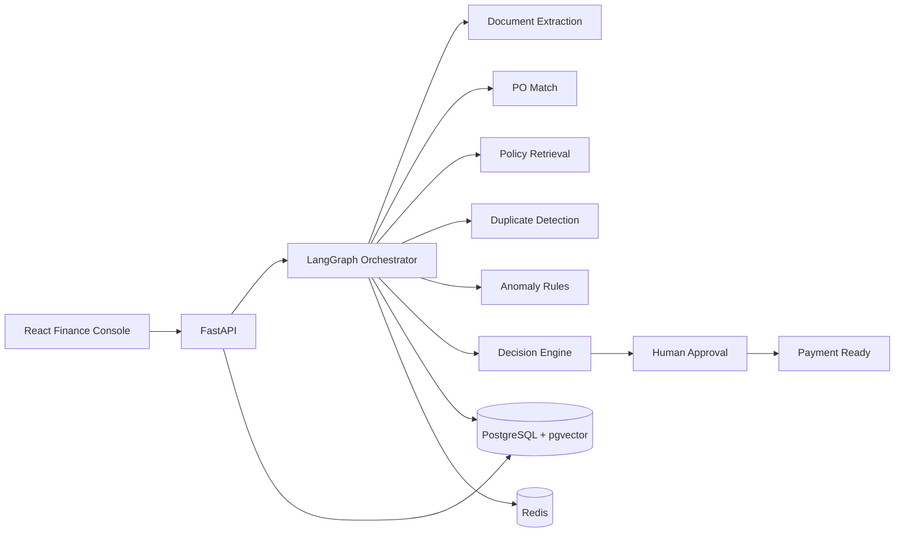

# Architecture

The graph coordinates bounded tools. It does not confer decision authority on the LLM. Calculation, validation, decision, approval routing, and state transitions are ordinary tested code.

## Workflow states

`UPLOADED → PROCESSING → VALIDATED/EXCEPTION → PENDING_APPROVAL → PAYMENT_READY`

Human reviewers may instead move an awaiting record to `REJECTED` or `CLARIFICATION_REQUESTED`. `PAID` is reserved for a future authorized ERP integration and cannot be reached by the MVP.

